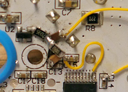
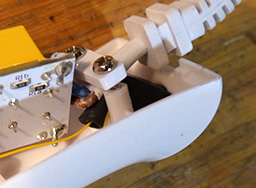

# MagicWandMods
Hardware and firmware mods for the "Europe Magic Wand", a quality Hitachi Magic Wand clone.

* Analog-in (CV): control by audio signal amplitude
* Serial: control by serial port

## Teardown
Be sure to unplug the EMW and wait a few minutes for the high-voltage capacitor to safely discharge before taking it apart.

The EMW is held together by 3 big phillips screws:
* On the back, close to the power cable, hidden by a plastic plug (hard to pull).
* Under the buttons silicone strip (just glued, can be lifted with a flat screwdriver).
* On the metal ring (visible).

Inside, the PCB is held in place by a central screw and two other ones used to fasten the power cable.
The PCB needs to be pulled out with a bit of effort because of the silicone joints.
**Be careful about the flex cable** going to the buttons on the back of the PCB, gently lift the black part of the connector to release it.
The motor should come loose out of the casing.

## Analog-in mod
Follow this schematic:

"AIN" is the analog input pin on the STM8 (pin #2, "PD5/AIN5"). R1 and R2 must be the same value and above 10k.

I made the circuit with 1206 SMDs, but there's plenty of space for trough-hole components.

I took the +5V from the regulator (U2), and ground from C13.

The wires can pick up some noise from the power supply circuit and the motor, but it's completly cancelled out by the firmware. Shielded audio cable isn't required.

## Serial mod

Solder two wires: one to ground and one to the STM8 pin #3 ("UART1_RX/PD6"). No need to add any components.

## External connection

Fit a 3.5mm jack socket next to the power cable, wrap it in 2 layers of heat-shrink tubing and hot-glue the wires to the casing to avoid any potential shorts with the mains voltage (**you DON'T want that**).

 

Connect the sleeve pin to the ground wire, and the tip (+ ring if you used a stereo cable) to the signal wire.

## Programming

Locate the 4 programming points on the PCB:

Connect a SWIM programmer (they're around $4 on eBay) to the annotated points.
Plug in the EMW. Be careful not to touch the PCB from now on !
Get ST Visual Programmer from .
Start STVP, select STLINK as the programmer and STM8S003F3 as the device.
Go in the OPTION BYTE tab. Make sure ROP is set to OFF, and AFR0 to "Port C6 Alternate Function".
Hit program, this will reset the protection and wipe the original firmware.

Back in the PROGRAM MEMORY tab, load the appropriate main.ihx file and hit program.
Disconnect the programmer, unplug the EMW, wait a bit, plug it back in. The new firmware should now be running.

## Usage
Individually, the "+" and "-" buttons work the same way.
The speed steps should also be the same as the original ones.

Keeping both the "+" and "-" buttons pushed at the same time will toggle between the regular mode, and the analog-in mode.
In the analog-in mode, the motor speed is multiplied by the amplitude of the input signal (so the speed adjustment and "off" speed still works).

Enjoy :3

## Disclaimer
I'm not responsible if you fuck everything up and/or die. Be careful, this isn't your mom's dishwasher.
This wasn't tested on animals (yet).
